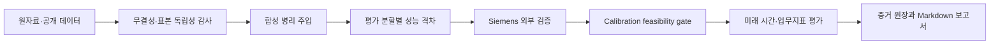

# 산업 검사 데이터 감사

제조 AI 프로젝트에서 높은 검증 정확도가 보고되어도 실제 다음 배치에서는 성능이 무너지는 경우가 있습니다. 저는 그 원인이 모델 구조보다 먼저 **데이터가 만들어진 방식과 평가 분할 방식**에 있을 수 있다고 보았습니다.

같은 PCB·사건에서 파생된 행이 학습과 평가에 동시에 들어가거나, 판정 결과를 만드는 정보가 입력값에 다시 포함되거나, 시간에 따른 공정 변화가 무작위 분할에 섞이면 모델은 현장을 일반화하지 않고도 높은 점수를 얻을 수 있습니다. 이 저장소는 새로운 이상탐지 모델을 제안하기 전에, 그런 위험을 모델링 전 단계에서 찾아낼 수 있는지 검증한 연구 기록입니다.

> 질문: 모델을 더 복잡하게 만들기 전에, 지금 보고 있는 성능이 현장에서 유지될 성능인지 어떻게 감사할 수 있을까?

## 이 연구에서 한 일

1. 라벨 순환, 판정 렌더링 누수, 날짜 교락과 사건 복제를 데이터 병리로 정의했습니다.
2. 각 병리를 인위적으로 주입한 합성 데이터에서 감사 지표가 의도한 방향으로 반응하는지 확인했습니다.
3. 감사 지표가 무작위 평가와 배치 조건 평가의 성능 격차를 설명하는지 실험했습니다.
4. 고정된 프로토콜을 Siemens SMT AOI 440,274행에 적용해 외부 타당성을 확인했습니다.
5. AUROC와 별도로 defect slip rate·volume reduction이라는 업무지표를 적용했습니다.
6. 논문에 공개된 시간 분할과 임계값 선택 절차를 부분 재현하고, 공개되지 않은 조건 때문에 재현할 수 없는 범위를 명시했습니다.

## 핵심 결과

| 단계 | 확인한 결과 | 해석 |
| --- | --- | --- |
| 데이터 감사 | true defect 4,622행이 875개 양성 timestamp에 집중 | 행 단위 표본이 서로 독립이라는 가정에 주의가 필요 |
| 동일 모델 평가 | 행 무작위 AUROC 0.741, timestamp 그룹 0.698, 미래 시간 0.727 | 사전 기준 0.05의 단일 격차 플래그는 발동하지 않음 |
| 시간 강건성 | 미래 5구간 AUROC 0.545~0.874 | 집계 점수 하나가 시간대별 변동성을 가릴 수 있음 |
| 선형 feasibility | slip rate 1% 목표에서 volume reduction 2.7% | 높은 분류 지표보다 업무 제약 충족 여부가 먼저임 |
| 비선형 feasibility | calibration AUROC 0.870, 미래 AUROC 0.878 | AUROC는 개선됐지만 volume reduction 목표 40%에는 미달 |
| 논문 프로토콜 부분 재현 | 무작위 test volume reduction 평균 71.58%, 미래 50개 조건 동시 통과 0건 | 무작위 분할에서 미래 평가로 갈 때 실패하는 방향을 재현 |

가장 중요한 결과는 “좋은 모델을 찾았다”가 아닙니다. **AUROC가 높아져도 결함을 보호하면서 실제 검사량을 줄이는 운영 목표를 만족하지 못할 수 있으며, 이 경우 시간 드리프트를 논하기 전에 학습 feasibility부터 실패로 판정해야 한다**는 순서를 확인했습니다.

## 실패를 결과로 남긴 이유

외부 검증에서는 일부 사전 가설이 발동하지 않았습니다. 비선형 모델도 엄격한 결함 보호 조건 아래에서 목표 검사량 감소를 만들지 못했습니다. 이 결과를 성공처럼 바꾸지 않고 다음과 같이 구분했습니다.

- 사전에 고정한 판정 기준과 사후 탐색 결과를 분리
- calibration gate가 실패하면 미래 성능을 시간 드리프트 효과로 해석하지 않음
- 논문 코드·탐색공간·최종 파라미터가 없으면 완전 재현이 아니라 부분 재현으로 한정
- 다음 데이터에서 확인할 후보와 현재 증거로 말할 수 있는 결론을 분리

이 구분은 제조 현장에서 모델 성능보다 잘못된 확신의 비용이 더 클 수 있다는 판단에서 출발했습니다.

## 실행 구조



실행 코드와 상세 보고서는 [`inspection_data_audit/`](inspection_data_audit/)에 있습니다.

| 구성 | 역할 |
| --- | --- |
| `audit_current_data.py` | 핵심 수치 재계산과 데이터 불일치 감사 |
| `simulate_pathologies.py` | 합성 병리 주입 벤치마크 |
| `performance_gap_experiment.py` | 무작위·그룹·배치 성능 격차 실험 |
| `download_siemens.py` | 공식 Siemens 파일 다운로드와 SHA-256 검증 |
| `external_validate_siemens.py` | 행 무작위·timestamp 그룹·미래 시간 외부 검증 |
| `temporal_followup_siemens.py` | 시간 강건성과 업무지표 후속 실험 |
| `nonlinear_feasibility_siemens.py` | 고정 비선형 모델의 calibration gate |
| `paper_protocol_reconstruction_siemens.py` | 공개된 논문 프로토콜의 부분 재현 |
| `outputs/` | 수치, 증거 원장과 자동 생성 보고서 |

## 기술 스택과 선택 이유

| 영역 | 기술 | 사용 목적 |
| --- | --- | --- |
| Core audit | Python 3 표준 라이브러리 | 핵심 감사 단계를 외부 패키지 없이 재현 |
| Data analysis | pandas, NumPy | 44만 행 규모 데이터 정규화와 집계 |
| Modeling | scikit-learn | 고정 선형·비선형 기준 모델과 분할 비교 |
| Validation | `unittest`, 고정 seed, SHA-256 | 계산 회귀·입력 무결성·실행 재현성 관리 |
| Reporting | CSV, JSON, Markdown | 수치·정의·출처·해석을 사람이 추적 가능한 형태로 보존 |

## 재현

공개 데이터만 사용하는 워크플로는 로컬 현장 데이터 실험과 분리했습니다.

```bash
git clone https://github.com/woorivermountain/inspection-data-audit.git
cd inspection-data-audit/inspection_data_audit
python3 -m venv .venv
source .venv/bin/activate
pip install -r requirements-lock.txt
python3 download_siemens.py --accept-license
./run_public.sh
```

원자료는 저장소에 포함하지 않습니다. 다운로드 전에 [공식 데이터 페이지](https://data.mendeley.com/datasets/99jzmh9658/1)의 CC BY-NC 3.0 표시와 Siemens Legal Notice를 직접 확인해야 합니다. 전체 환경과 결과 확인 방법은 [재현 가이드](inspection_data_audit/REPRODUCE.md)에 기록했습니다.

## 담당 범위와 협업에 사용하는 산출물

- 문제 정의와 연구 질문을 모델 개발 전에 문서화
- 데이터 병리, 평가 분할과 업무지표를 실행 가능한 코드로 변환
- 모든 핵심 수치를 `evidence_ledger.csv`에서 정의·출처·해석과 연결
- 분석 결과를 개발자뿐 아니라 공정·품질 담당자가 검토할 수 있는 Markdown 보고서로 출력
- 확인된 사실, 해석 가능한 범위와 다음 가설을 분리해 커뮤니케이션

이 작업에서 협업의 핵심은 분석 결과를 많이 만드는 것이 아니라, **데이터 담당자·모델 개발자·현업 담당자가 같은 수치의 의미와 사용 한계에 합의할 수 있는 구조를 만드는 것**이라고 보았습니다.

## 현재 한계와 다음 단계

- Siemens 한 종류의 공개 외부 데이터만 검증했기 때문에 공정 일반화를 주장할 수 없습니다.
- 시간·설비·제품군 메타데이터의 의미가 제한되어 실제 라인 변경 원인을 설명할 수 없습니다.
- 발표 모델의 모든 구현 조건이 공개되지 않아 논문 결과를 완전히 재현하지 못했습니다.
- 다음 단계는 두 번째 외부 데이터에서 감사 프로토콜을 고정 검증하고, 데이터 생성 과정에 대한 현장 암묵지를 지표 해석과 연결하는 것입니다.
