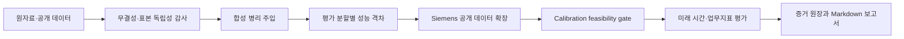

# 산업 검사 데이터 감사

**모델을 학습하기 전에 데이터와 평가 방식이 적절한지 확인하는 연구입니다.** 비전 검사 일경험에서 판정 테두리의 적색만으로 AUROC 1.0000이 나오는 현상을 발견했습니다. 표시를 제거하고 표본·시간 분할을 다시 확인한 뒤, 공개 Siemens 데이터로 감사 절차와 검사량 절감 기준을 확장했습니다.

[실행 코드·보고서](inspection_data_audit/) · [재현 가이드](inspection_data_audit/REPRODUCE.md)

`Python` · `pandas` · `scikit-learn` · `Temporal Validation` · `Reproducible Research`

## 연구가 시작된 맥락

DaiS Lab 학부연구생으로 참여한 비전 검사 일경험에서 데이터 검증을 맡았습니다. 점수가 높게 나온 이유를 살펴보니, 판정 후 그려진 테두리가 입력 이미지에 남아 있었습니다. 새로운 모델을 고르기 전에 차폐·치환 실험과 평가 분할로 이 정보가 결과에 미치는 영향을 확인했습니다.

이후에는 같은 질문을 공개 데이터에서 검토할 수 있도록 연구를 확장했습니다. Siemens SMT AOI 데이터에 고정 프로토콜을 적용하고, 분류 점수와 별도로 결함 누락률과 검사량 절감을 계산했습니다. 현장 일경험의 데이터 감사와 공개 데이터의 확장 실험을 구분해 기록했습니다.

## 담당 역할

문제 정의, 데이터 적격성 감사, 합성 실험, 평가 분할과 업무지표 계산을 코드로 구현했습니다. 핵심 수치는 `evidence_ledger.csv`에 정의·출처·해석을 연결하고, 개발자와 공정·품질 담당자가 검토할 수 있는 Markdown 보고서로 출력했습니다.

같은 입력과 기준으로 결과를 검토할 수 있도록 코드·계산 조건·보고서를 함께 남겼습니다.

## 대표 결과

| 실험 | 확인한 결과 | 다음 선택 |
| --- | --- | --- |
| 일경험 데이터 감사 | 이미지 **364장**, 검사 로그·ROI **7,800행**에서 테두리 정보 누설을 **2,000회 치환검정**과 차폐·치환으로 확인했습니다. | 표시 제거 후 불합격 표본이 부족해 학습을 보류하고 최소 **13건**, 권장 **20건**의 추가 수집을 제안했습니다. |
| 공개 데이터 확장 | Siemens SMT AOI **440,274행**에서 평가 분할과 업무지표를 비교했습니다. | 사전 기준과 사후 탐색을 분리해 남겼습니다. |
| 고정 비선형 모델 | 미래 전체 AUROC **0.878**, 결함 누락률 **0.85%**, 검사량 절감 **3.16%**를 얻었습니다. | calibration부터 절감 목표 **40%**를 충족하지 못해 적용을 보류했습니다. |

높은 AUROC만으로 도입을 결정하기 어렵다는 점을 확인했습니다. 먼저 calibration에서 업무 목표를 충족하는지 판단하고, 통과한 경우에 미래 시간의 성능을 평가하도록 순서를 정리했습니다.

## 빠른 시작

공개 데이터 워크플로는 일경험의 현장 원자료 실험과 분리했습니다. 원자료를 저장소에 포함하지 않으며, 아래 명령은 Siemens 공개 데이터를 사용합니다.

```bash
git clone https://github.com/woorivermountain/inspection-data-audit.git
cd inspection-data-audit/inspection_data_audit
python3 -m venv .venv
source .venv/bin/activate
pip install -r requirements-lock.txt
python3 download_siemens.py --accept-license
./run_public.sh
```

다운로드 전에 [공식 데이터 페이지](https://data.mendeley.com/datasets/99jzmh9658/1)의 CC BY-NC 3.0 표시와 Siemens Legal Notice를 확인합니다. 실행 환경과 산출물 확인 방법은 [재현 가이드](inspection_data_audit/REPRODUCE.md)에 정리했습니다.

## 다음으로 볼 문서

- [실행 코드와 보고서](inspection_data_audit/)에서 각 감사 단계의 구현을 볼 수 있습니다.
- [재현 가이드](inspection_data_audit/REPRODUCE.md)에서 공개 데이터 실험을 다시 실행할 수 있습니다.
- 아래 접힌 절에 전체 결과, 스크립트와 해석 기준을 정리했습니다.

<details>
<summary>연구 질문과 감사 절차</summary>

같은 PCB·사건에서 파생된 행이 학습과 평가에 함께 들어가거나, 판정 결과를 표시한 정보가 입력값에 포함되면 높은 점수가 나올 수 있습니다. 시간에 따른 공정 변화가 무작위 분할에 섞이는 경우도 살펴봤습니다. 이런 조건을 모델링 전에 확인할 수 있는지가 연구 질문입니다.

1. 라벨 순환, 판정 렌더링 누설, 날짜 교락과 사건 복제를 데이터 병리로 정의했습니다.
2. 합성 데이터에 각 병리를 주입해 감사 지표가 의도한 방향으로 반응하는지 확인했습니다.
3. 무작위 평가와 배치 조건 평가의 성능 격차를 비교했습니다.
4. 고정 프로토콜을 Siemens SMT AOI 440,274행에 적용해 별도의 공개 데이터에서 동작을 확인했습니다.
5. AUROC와 함께 defect slip rate·volume reduction을 계산했습니다.
6. 공개 논문의 시간 분할·임계값 선택 절차를 부분 재현하고, 공개되지 않은 구현 조건은 남은 범위로 기록했습니다.


```mermaid
flowchart LR
  A[원자료·공개 데이터] --> B[무결성·표본 독립성 감사]
  B --> C[합성 병리 주입]
  C --> D[평가 분할별 성능 격차]
  D --> E[Siemens 공개 데이터 확장]
  E --> F[Calibration feasibility gate]
  F --> G[미래 시간·업무지표 평가]
  G --> H[증거 원장과 Markdown 보고서]
```

</details>

<details>
<summary>전체 결과와 사전 판정 기준</summary>

### 현장 데이터 감사

테두리 적색 지표의 LODO AUROC는 1.0000이었습니다. 이는 학습한 부품 이미지 모델의 일반화 성능과 구분합니다. 판정 표시를 제거한 PatchCore의 LODO AUROC는 0.5578로 보고돼 있습니다. 표시 제거 후의 표본 수와 독립성을 먼저 확인해야 한다고 판단했습니다.

### Siemens 공개 데이터 확장

| 단계 | 확인한 결과 | 해석 |
| --- | --- | --- |
| 데이터 감사 | true defect **4,622행**이 **875개** 양성 timestamp에 집중됐습니다. | 행 단위 표본의 독립성 가정을 검토해야 합니다. |
| 동일 모델 평가 | 행 무작위 AUROC **0.741**, timestamp 그룹 **0.698**, 미래 시간 **0.727**이었습니다. | 사전 기준 **0.05**의 단일 격차 플래그는 발동하지 않았습니다. |
| 시간 강건성 | 미래 **5구간** AUROC가 **0.545~0.874**였습니다. | 전체 점수와 시간대별 변동을 함께 확인합니다. |
| 선형 feasibility | slip rate **1%** 목표에서 volume reduction이 **2.7%**였습니다. | 분류 지표와 업무 제약 충족 여부를 분리합니다. |
| 비선형 feasibility | calibration AUROC **0.870**, 미래 AUROC **0.878**이었습니다. | AUROC는 개선됐지만 절감 목표 **40%**에 미달했습니다. |
| 논문 프로토콜 부분 재현 | 무작위 test volume reduction 평균 **71.58%**, 미래 **50개** 조건 동시 통과 **0건**이었습니다. | 무작위 분할에서 미래 평가로 바뀔 때 실패하는 방향을 부분 재현했습니다. |

비선형 실험은 calibration에서 정한 임계값을 미래 구간에서도 고정했습니다. 미래 전체 결함 누락률은 0.85%, 검사량 절감은 3.16%였지만, 마지막 시간 구간의 결함 누락률은 1.39%였습니다. 전체 평균과 각 시간 구간의 결과를 구분해 해석합니다.

### 결과를 해석한 기준

- 사전에 고정한 판정 기준과 사후 탐색 결과를 분리했습니다.
- calibration gate가 실패하면 미래 결과를 시간 드리프트의 효과로 해석하지 않았습니다.
- 논문 코드·탐색공간·최종 파라미터가 공개되지 않은 범위는 완전 재현으로 부르지 않았습니다.
- 다음 데이터에서 확인할 후보와 현재 실험에서 확인한 결론을 나눴습니다.

일부 사전 가설은 외부 데이터에서 발동하지 않았고, 비선형 모델도 엄격한 결함 보호 조건에서 목표 검사량 감소를 만들지 못했습니다. 이 결과를 남겨 모델 성능의 개선과 도입 가능성을 같은 의미로 사용하지 않도록 했습니다.

</details>

<details>
<summary>실행 스크립트와 기술 스택</summary>

실행 코드와 상세 보고서는 [`inspection_data_audit/`](inspection_data_audit/)에 있습니다.

| 구성 | 역할 |
| --- | --- |
| `audit_current_data.py` | 핵심 수치를 다시 계산하고 데이터 불일치를 감사합니다. |
| `simulate_pathologies.py` | 합성 병리 주입 벤치마크를 실행합니다. |
| `performance_gap_experiment.py` | 무작위·그룹·배치 성능 격차를 비교합니다. |
| `download_siemens.py` | 공식 Siemens 파일을 다운로드하고 SHA-256을 확인합니다. |
| `external_validate_siemens.py` | 행 무작위·timestamp 그룹·미래 시간 평가를 실행합니다. |
| `temporal_followup_siemens.py` | 시간 강건성과 업무지표를 후속 평가합니다. |
| `nonlinear_feasibility_siemens.py` | 고정 비선형 모델의 calibration gate를 평가합니다. |
| `paper_protocol_reconstruction_siemens.py` | 공개된 논문 프로토콜을 부분 재현합니다. |
| `outputs/` | 수치, 증거 원장과 자동 생성 보고서를 저장합니다. |

| 영역 | 기술 | 사용 목적 |
| --- | --- | --- |
| Core audit | Python 3 표준 라이브러리 | 핵심 감사 단계를 외부 패키지 없이 재현합니다. |
| Data analysis | pandas, NumPy | 44만 행 규모 데이터를 정규화하고 집계합니다. |
| Modeling | scikit-learn | 고정 선형·비선형 기준 모델과 분할을 비교합니다. |
| Validation | `unittest`, 고정 seed, SHA-256 | 계산 회귀, 입력 무결성과 실행 재현성을 관리합니다. |
| Reporting | CSV, JSON, Markdown | 수치·정의·출처·해석을 연결합니다. |

</details>

<details>
<summary>다음 검증</summary>

현재 외부 평가는 Siemens 한 종류의 공개 데이터에 한정됩니다. 시간·설비·제품군 메타데이터의 의미가 제한돼 실제 라인 변경 원인을 설명하지는 못했습니다. 발표 모델의 모든 구현 조건이 공개되지 않은 범위도 남아 있습니다.

다음 단계에서는 두 번째 외부 데이터에 감사 프로토콜을 고정해 적용하고, 데이터가 만들어지는 과정의 현장 암묵지를 지표 해석과 연결하려고 합니다. 담당자·모델 개발자·현업 담당자가 같은 수치의 정의와 판단 기준을 공유할 수 있는 형태로 결과를 남깁니다.

</details>
